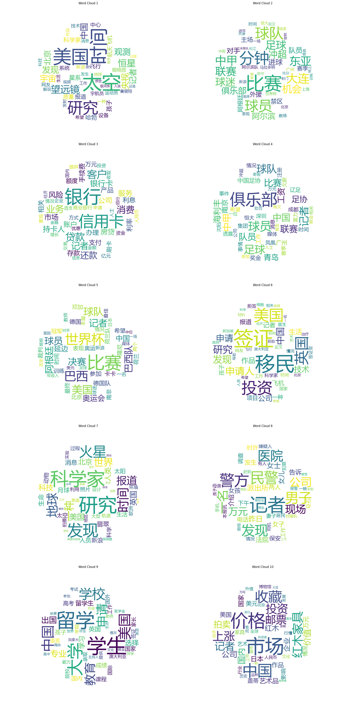

# PLSA-EM-topic analysis

意在基于PLSA方法来实现文本的主题分析任务，通过EM算法优化。采用的数据集为[THUCNews](http://thuctc.thunlp.org/ "THUCNews")，尝试使用了其中来自五个大类的2000篇文章作为子集的小数据集，以及整个数据集作为大数据集。

* `model.py`​实现了类别以及对应的各函数
* ​`experiment_samll.py`​为将模型构建在小数据集上的过程，运行时间略长，需要数分钟

可以通过`printTopK`​来输出当前模型中所有类别中在`topic-word`​概率矩阵中对应概率前topK的词，通过`showgraph`​则可以以词云图的形式来表示主题分析的结果。

小数据集中，将超参数k设置为10，最终选择出10个主题，可以查看各主题下的关键词，以对应的参数作为权重可以用于绘制词云图。大致效果如下：

‍

​​

而大数据集由于考虑了整个THUCNews数据集的文本，将类别数设置为14，具体结果待补充。
